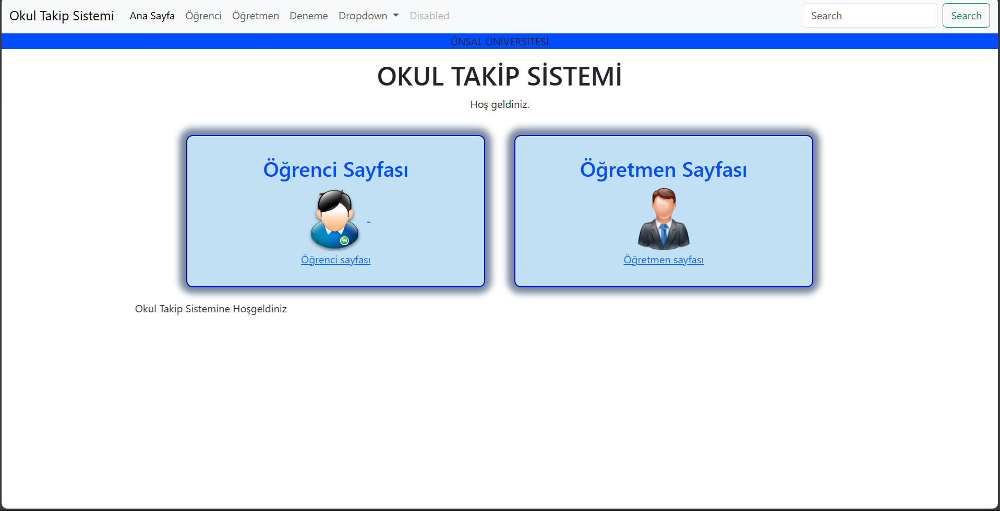
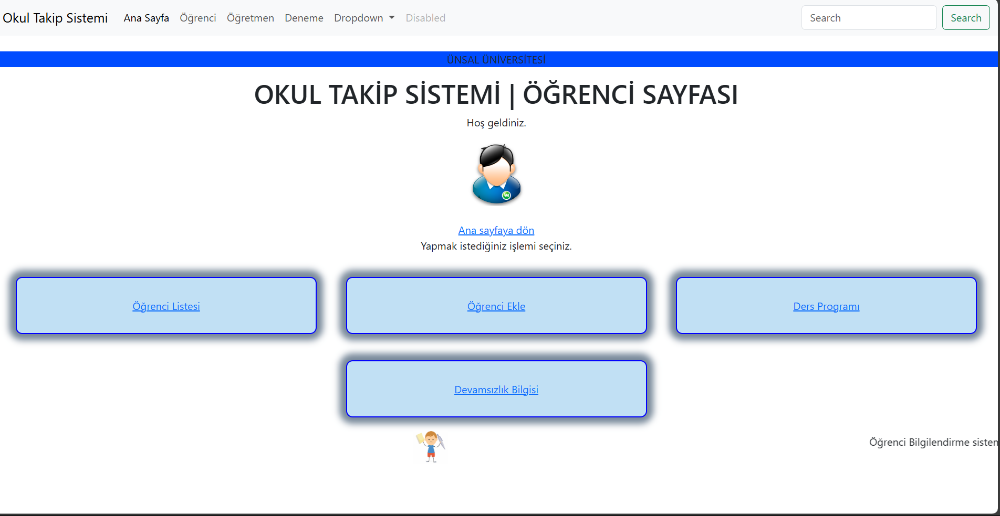
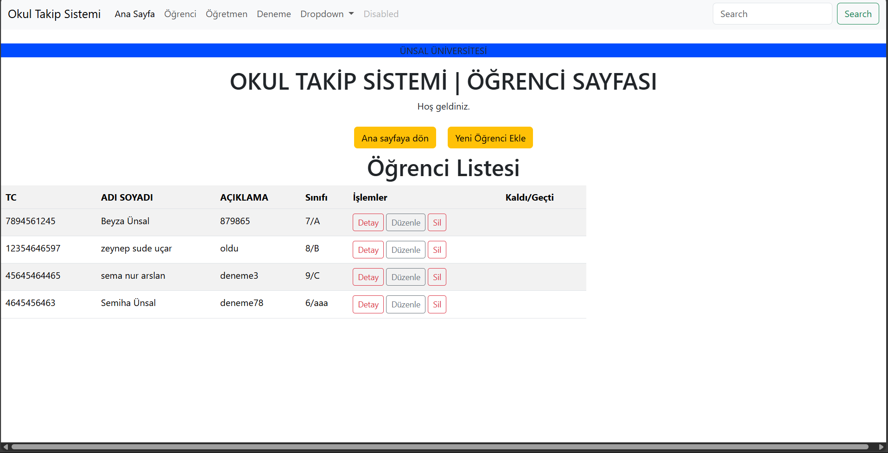
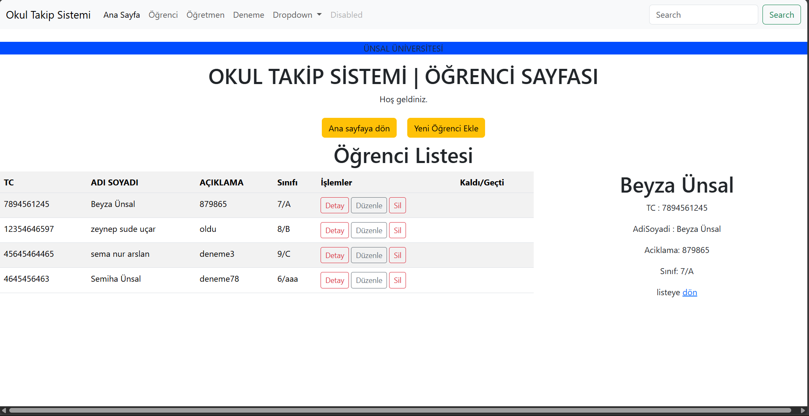
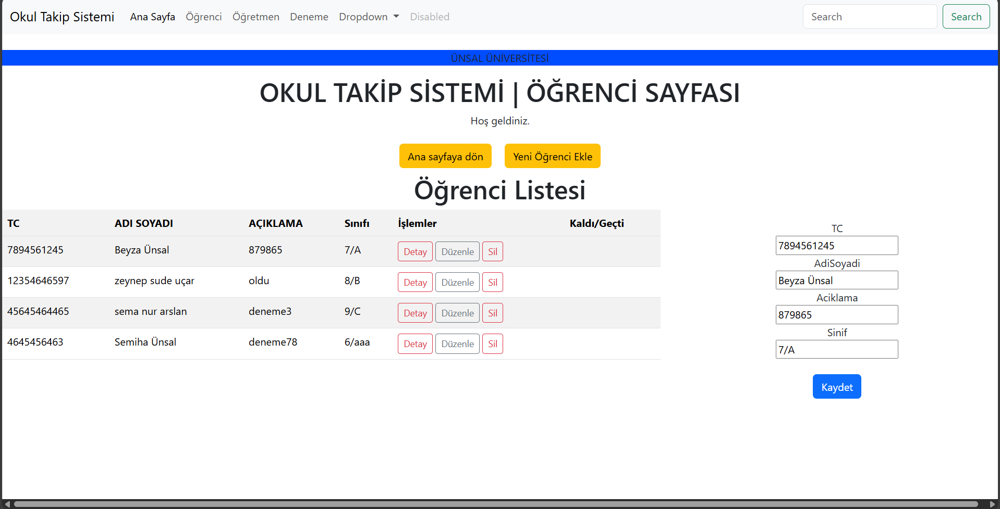
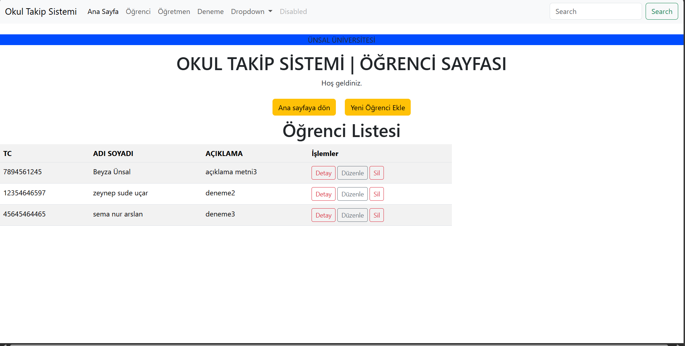

# WEB Uygulaması
## Beyza ÜNSAL

<h3>Web Uygulaması Ana Menü</h3>
Bu Python tabanlı web uygulaması, eğitim kurumlarının öğrenci bilgilerini yönetmelerine yönelik pratik bir çözüm sunmaktadır. Kullanıcı dostu bir arayüze sahip olan bu uygulama, aşağıdaki işlevleri içermektedir:

<h3>Web Uygulaması Öğrenci Menüsü</h3>

<h3>Web Uygulaması Öğrenci Menüsü / Öğrenci Listesi</h3>
&#x1F4CC;Öğrenci Listeleme: Kullanıcılar, mevcut tüm öğrencilerin bilgilerini kolayca görüntüleyebilir. Listeleme özelliği, kullanıcıların öğrenci verilerine hızlı erişimini sağlar.

<h3>Web Uygulaması Öğrenci Menüsü / Öğrenci Listesi Detay </h3>
&#x1F4CC;Kullanıcılar, yeni öğrenci kayıtlarının detaylarını görüntülemek için form tabanlı bir arayüz kullanır.Gerekli bilgilerin (TC kimlik numarası, adı, soyadı, sınıf, iletişim bilgileri vb.) hızlıca görüntülemeye olanak tanır.
Eklenen her öğrenci kaydı, anında güncellenen listeye yansır.

<h3>Web Uygulaması Öğrenci Menüsü / Öğrenci Listesi Düzenleme </h3>
&#x1F4CC;Öğrenci Düzenleme: Mevcut öğrenci kayıtları üzerinde düzenleme yapma imkanı sağlar. Kullanıcılar, gerekli değişiklikleri yaparak bilgilerin güncel kalmasını sağlayabilir.

<h3>Web Uygulaması Öğrenci Menüsü / Öğrenci Listesi Silme </h3>
&#x1F4CC;Öğrenci Silme: Kullanıcılar, sistemdeki öğrenci kayıtlarını kolaylıkla silebilir. Bu işlem, öğrenci bilgilerinin yönetimini kolaylaştırır ve gereksiz kayıtların sistemden kaldırılmasına olanak tanır.

